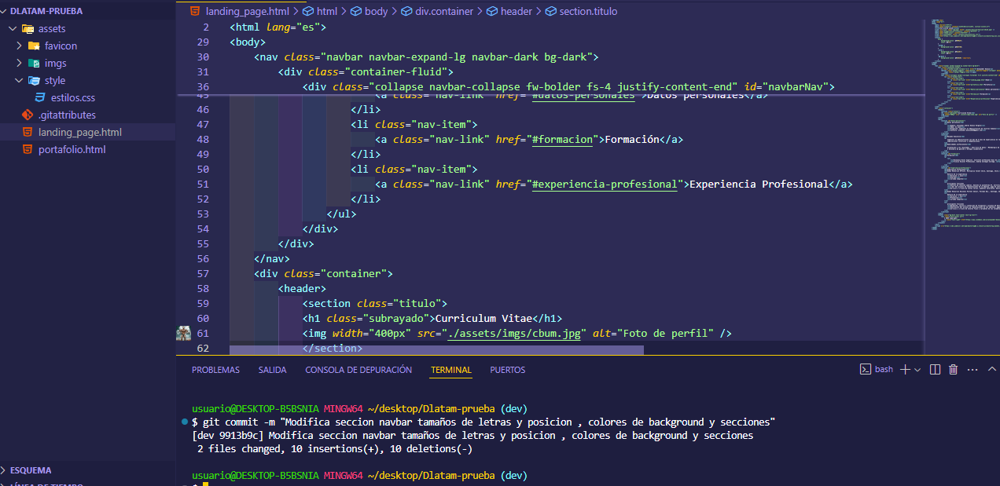
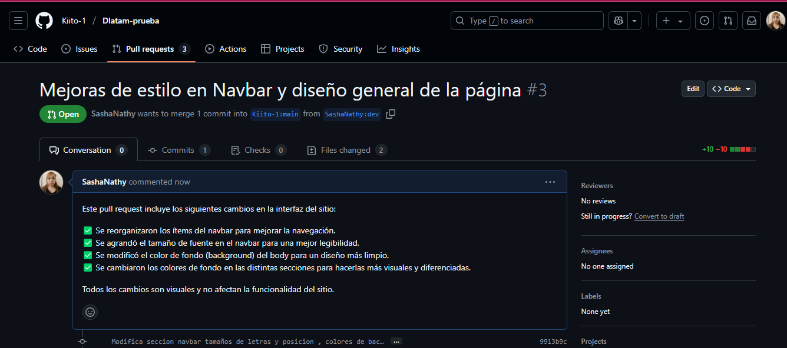

# 🚀 Prueba Final - Módulo 1: Mi Currículum Web

Este es mi prueba final del **primer módulo de desarrollo web**.  
Se trata de una página web donde presento mi **currículum personal**, incluyendo:

- Información sobre mí
- Habilidades
- Experiencias
- Educación
- Portafolio

Además, el sitio cuenta con una **barra de navegación (navbar)** que permite desplazarse fácilmente a todas las secciones de la página con solo un clic. 🧭

---

## 🛠️ Tecnologías utilizadas

- 🧱 HTML  
- 🎨 CSS  
- ⚙️ Bootstrap  

---

## 📌 Primer trabajo forkeado y su primer commit

Este fue mi **primer trabajo forkeado** y el commit inicial está representado en la siguiente imagen:

## 📌 Segundo trabajo forkeado y commits.

## ✨ Cambios realizados en el Pull Request

En el pull request se incluyen los siguientes cambios en la interfaz del sitio:

- ✅ Se reorganizaron los ítems del navbar para mejorar la navegación.  
- ✅ Se agrandó el tamaño de fuente en el navbar para una mejor legibilidad.  
- ✅ Se modificó el color de fondo (background) del body para un diseño más limpio.  
- ✅ Se cambiaron los colores de fondo en las distintas secciones para hacerlas más visuales y diferenciadas.

🛠️ Todos los cambios son visuales y **no afectan la funcionalidad del sitio**.

