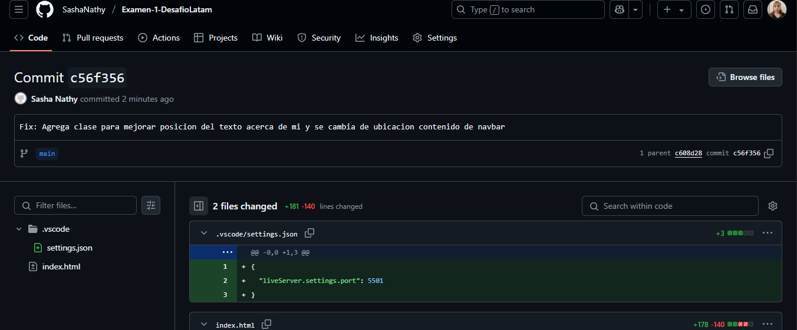

#Prueba Final - Módulo 1: Mi Currículum Web

Este es mi prueba final del primer módulo de desarrollo web. Se trata de una página web donde presento mi currículum personal, incluyendo información sobre mí, habilidades, experiencias, educacion y portafolio.

## Tecnologías
- HTML
- CSS
- Bootstrap

## Primer trabajo forkeado y su commit.

![Primer commit de Cv Matias]
